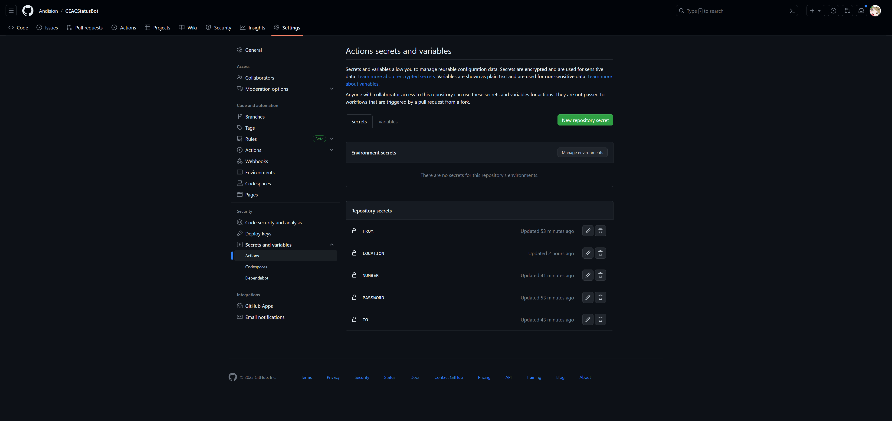

# CEACStatusBot🤖

[查看中文文档](README.Chinese.md)

Automatically check your U.S. visa application status in [CEAC](https://ceac.state.gov/CEACStatTracker/Status.aspx?App=NIV) and notify you instantly when it updates! 

## Usage

You can deploy it to your own machine, but it is highly recommended to use Github Actions. 

### Environment Variables

- LOCATION: the location where you applied for your visa. To find the corresponding location name for the embassy, please refer to [this table](LOCATION.md). Use the embassy location name directly, such as `CHINA, BEIJING`.

- NUMBER: your Application ID or Case Number help icon (e.g., AA0020AKAX or 2012118 345 0001) 

- PASSPORT_NUMBER: your passport number

- SURNAME: first 5 Letters of surname

- TIMEZONE: optional, set your timezone to avoid disturbing during sleep. :-) Some example: `Asia/Shanghai` `America/New_York`

- GH_TOKEN: to access previous status, you need to set a Github token with `repo` scope. You can create a new token in Github -> Settings -> Developer settings -> Personal access tokens.

#### Notification by Email

Add the following env variables if you want to send notification by email.

- FROM: the email address you use to send the notification.

- TO: the email address you want the notification sent to. You can send to more than one email, split the email address with "|" and without space. Here is an example: `first@email.com|second@email.com|third@email.com`

- PASSWORD: the password of the `FROM` email. Notice: for some email, such as QQ Mail, you should use "authorization code" instead of your password here, because this repo use SMTP to send email. Check the SMTP usage of your Mailbox Service Provider for more details.

- SMTP: (optional) specify the smtp server to send the email (e.g. `smtp.example.com`, `smtp.example.com:587`)

#### Notification by Telegram bot

Add the following env variables if you want to send notification by a Telegram bot.

Create a Telegram bot and get the info below according to [this tutorial](https://gist.github.com/nafiesl/4ad622f344cd1dc3bb1ecbe468ff9f8a).

- TG_BOT_TOKEN: the bot token

- TG_CHAT_ID: the chat id you want to receive the notification

### Github Actions

1. folk this repo

2. set your Environment Variables in `Github -> Settings -> Secrets and variables -> Actions -> New repository secret`


3. check your workflow in Actions and your Mailbox / Telegram

### Local Usage
You can also run this bot locally. Simply clone this repo and use uv to build the environment:

```bash
pip install uv # if you don't have uv installed
uv sync
uv run trigger.py
```

## TODO

- [x] Send Email to multiple emails.
- [x] Add more third-party notification services.
- [ ] More human-friendly interface.

## Special Thanks

### Contributor

[h4x3rotab](https://github.com/h4x3rotab) : Telegram bot, Adaption to new CEAC interface

### Related Project

Part of the code in this repo refers to the following project. Thank you for your pretty work.

- [ceac_tracker](https://github.com/lixin-wei/ceac_tracker)
- [CEACStatTracker](https://github.com/yuzeming/CEACStatTracker)